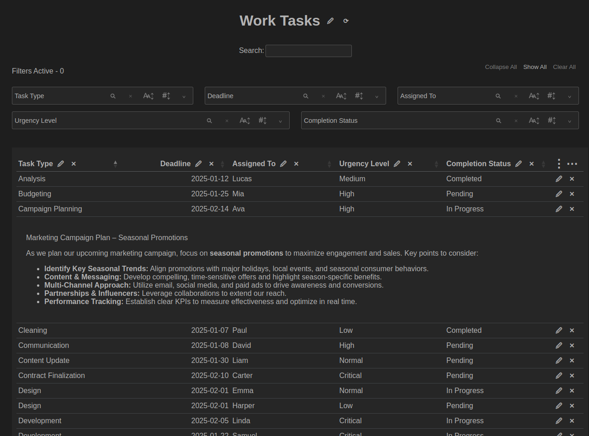

# Column Notes

An Electron application designed for a unique style of note-taking that organizes notes by user-defined columns and attributes. Instead of traditional linear or hierarchical structures, Column Notebooks present notes in a table format, making it easier to search, filter, and browse notes efficiently.

