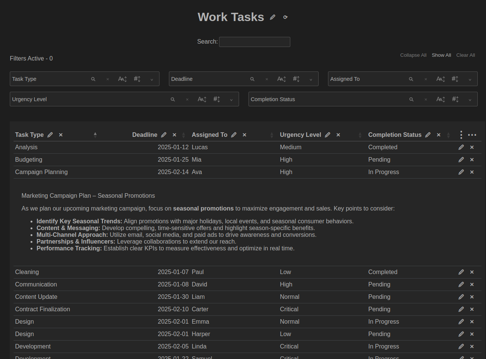

# Column Notes

An Electron application designed for a unique style of note taking that organizes notes by user-defined columns and attributes. Instead of traditional linear or hierarchical structures, Column Notebooks present notes in a table format, making it easier to search, filter, and browse notes efficiently.

## Features

- **Column-Based Organization** – Define custom attributes and categorize notes with a table-like structure.
- **Searching & Filtering** – Quickly locate notes by filtering and searching through column values.
- **Markdown Rendering** – Write notes in Markdown for rich formatting.
- **Code Syntax Highlighting** – Built-in syntax highlighting for code snippets in multiple programming languages.
- **One-Click Copy Code Blocks** – Easily copy code snippets with a single click for faster workflow.
- **Single-File Notebooks** – Save and share your entire notebook in a single file for easy portability.
- **100% Offline** – Fully functional without an internet connection.

[//]: # (work in progress: **Cross-Platform** – A NodeJS/Electron desktop app available for Windows, macOS, and Linux.)

## Usage

### Reload Notebook
To reload the notebook, click the **⟳** button to the right of the title.

### Edit Title
Click on the **🖉** button to the right of the title to edit it. Modify the title as needed and press **Save** to save changes or **Cancel** to discard the edits.  

### Add/Edit/Delete Note
- **Add Note**: Click the **⋯** button at the top of the far right column. Enter your note content and save.  
- **Edit Note**: Click on the **🖉** button in the far right column of the note you would like to edit. Make changes and save to update the content.  
- **Delete Note**: Click on the **✕** button in the far right column of the note you would like to delete. Confirm your deletion to remove the note permanently.  

### Add/Edit/Delete Column
- **Add Column**: Click the **⋮** button at the top of the far right column. Enter your column name and save.  
- **Edit Column**: Click the **🖉** button in the column header you would like to edit. Make changes and save to update the content.  
- **Delete Column**: Click on the **✕** button in the column header you would like to delete. Confirm your deletion to remove the column permanently.  

### Search
Use the **Search Bar** at the top to find notes based on attributes that match within the notebook (case insensitive). Results will update dynamically as you type.

### Filters
Filters allow you to narrow down the displayed notes based on their column attributes. Apply filters by selecting attributes from the associated column's filter dropdown panel.

Filter attributes can be sorted alphabetically or by the number of times each attribute appears in the notes.

### Collapse/Show/Clear All Filters  
- **Collapse All Filters**: Click the **Collapse All** button to hide all filter dropdown panels.  
- **Show All Filters**: Click the **Show ALl** to reveal all filter dropdown panels.  
- **Clear All Filters**: Use the **Clear All Filters** button to remove all active filters.  

### Column Reordering
Drag and drop column headers to rearrange their order. 

### Sort Rows by Column
Click on a column header to sort rows in ascending or descending order.  

Hold **Shift** and click multiple column headers to apply multi-column sorting. The sorting order will follow the sequence of clicks.

